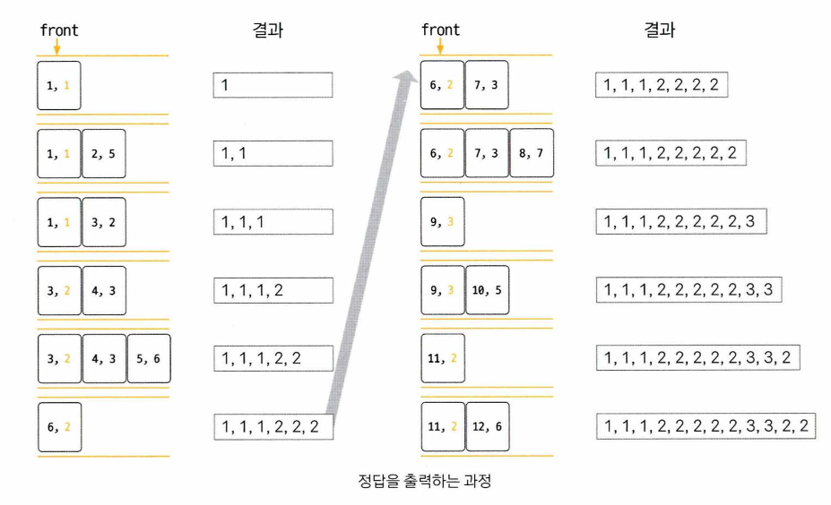

# 2. 11003 최솟값 찾기

# Link
- https://icpc.me/11003


# 문제 풀이 아이디어 (2) - deque 를 사용하는 방식
자세한 내용은 Do it 알고리즘 코딩테스트의 설명을 참고했다.

## 아이디어



## python 
```python
import sys
from collections import deque

N,L = map(int, sys.stdin.readline().strip().split())

## 1 base 배열을 만들기 위해 [0] 추가
A = [0] + list(map(int, sys.stdin.readline().strip().split()))
window_size = L

dq = deque()

for i in range(1, len(A)):
    while dq and dq[-1][0] > A[i]: ## (1) : 걸러내기 
        dq.pop()
    
    dq.append((A[i], i)) ## (2) : (1) 에서 걸러낸 후 깨끗해진 곳에 새로운 요소를 append()

    if dq[0][1] < i - window_size +1: ## (3) : 사이즈를 넘어서면 pop
        dq.popleft()
    
    print(dq[0][0], end=' ')

```
<br/>


# 문제 풀이 아이디어 (1) - 1차원적인 접근
이 문제는 **슬라이딩 윈도우 최솟값** 문제입니다. 예제를 통해 문제의 의미를 설명해드리겠습니다.

## 문제 이해

주어진 예제에서:
- N = 12, L = 3
- 배열 A = `[1, 5, 2, 3, 6, 2, 3, 7, 3, 5, 2, 6]`

각 Di는 "Ai-L+1부터 Ai까지의 구간에서 최솟값"입니다.

## 단계별 계산 예시

**A-1 \~ A1** (A-1, A0 무시, A1만 검사)
**D1**: A1-3+1 \~ A1 = **A-1 \~ A1**
- i ≤ 0인 인덱스는 무시하므로 A1만 고려 → D1 = 1

**A0 \~ A2** (A0 무시, A1,A2 만 검사)
**D2**: A2-3+1 \~ A2 = **A0 \~ A2**
- A0는 무시, A1, A2만 고려 → min(1, 5) = 1 → D2 = 1

**A1 ~ A3** (A1,A2,A3 사이의 최소값)
**D3**: A3-3+1 \~ A3 = **A1 \~ A3**
- A1, A2, A3 고려 → min(1, 5, 2) = 1 → D3 = 1

**A2 \~ A4** (A2,A3,A4 사이의 최소값)
**D4**: A4-3+1 \~ A4 = **A2 \~ A4**
- A2, A3, A4 고려 → min(5, 2, 3) = 2 → D4 = 2

**A3 \~ A5** (A3,A4,A5 사이의 최소값)
**D5**: A5-3+1 \~ A5 = A3 \~ A5
- A3, A4, A5 고려 → min(2, 3, 6) = 2 → D5 = 2

이런 식으로 계속하면:
- D6 = min(3, 6, 2) = 2
- D7 = min(6, 2, 3) = 2
- D8 = min(2, 3, 7) = 2
- D9 = min(3, 7, 3) = 3
- D10 = min(7, 3, 5) = 3
- D11 = min(3, 5, 2) = 2
- D12 = min(5, 2, 6) = 2

결과: `1 1 1 2 2 2 2 2 3 3 2 2`


## 핵심 아이디어

1\. **슬라이딩 윈도우**: 크기 L인 윈도우가 배열을 따라 이동하면서 각 위치에서의 최솟값을 구합니다.
2\. **경계 처리**: 윈도우가 배열의 시작 부분에 있을 때는 유효한 인덱스만 고려합니다.
3\. **효율적 구현**: 단순히 매번 구간의 최솟값을 구하면 O(N×L)이 되어 시간 초과가 발생할 수 있으므로, 덱(deque)을 사용한 O(N) 알고리즘이 필요합니다.

이 문제는 각 위치에서 "최근 L개 원소 중 최솟값"을 효율적으로 구하는 전형적인 슬라이딩 윈도우 문제입니다.


## python (1)
이렇게 풀 경우 시간초과가 발생한다.
```python
import sys

N,L = map(int, sys.stdin.readline().strip().split())

## 1 base 배열을 만들기 위해 [0] 추가
A = [0] + list(map(int, sys.stdin.readline().strip().split()))
window_size = L


result = ''
for i in range(1, len(A)):
    start = i - window_size + 1 ## (-1 -> 0 -> 1 -> ...)
    t = 123456789

    for curr in range(start, start+window_size):
        if curr <= 0:
            continue
        t = min(t, A[curr])
    
    result += (str(t) + ' ')

print(result)
```
<br/>


