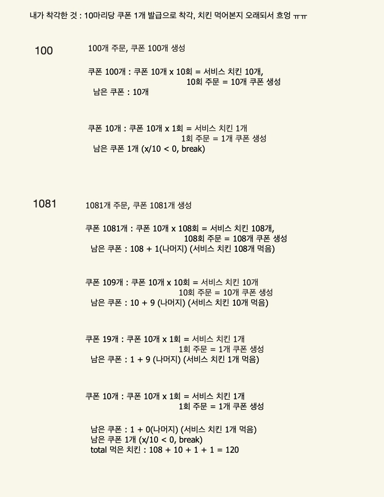

나는 시뮬레이션/구현 쪽이 약하다. 그림을 그려서 이해하려고 하는데, 그림 그릴 곳이 없어. 펜이 없어. 이렇게 반복해. 이러면서 구현을 머릿속으로만 생각하는 케이스가 있다.
시뮬레이션/구현은 머릿속으로 상상해서 푸는게 아니라 절차를 써두고 이걸 일반화하는 과정이 있어야 한다.
안그러면 다 외계어로 보인다.

# Link
https://school.programmers.co.kr/learn/courses/30/lessons/120884


# 문제 풀이 아이디어


e.g. 100개 일때
100개 주문, 쿠폰 100개 생성
- 쿠폰 100개 : 쿠폰 10개 x 10회 = 서비스 치킨 10개
	- (10회 주문 = 10개 쿠폰 생성)
	- 남은 쿠폰 10개
- 쿠폰 10개 : 쿠폰 10개 x 1회 = 서비스 치킨 1개
	- (1회 주문 = 1개 쿠폰 생성)
	- 남은 쿠폰 1개 (break)
- 먹은 서비스 치킨 : 10개+ 1개 = 11개


e.g. 1081개 일때
1081개 주문, 쿠폰 1081개 생성
- 쿠폰 1081개 : 쿠폰 10개 x 108 회 = 서비스 치킨 108개
	- (108회 주문 = 108개 쿠폰 생성)
	- 남은 쿠폰 : 108 + 1 (나머지)
- 쿠폰 109개 : 쿠폰 10개 x 10회 = 서비스 치킨 10개
	- (10회 주문 = 10개 쿠폰 생성)
	- 남은 쿠폰 : 10 + 9 (나머지)
- 쿠폰 19개 : 쿠폰 10개 x 1회 = 서비스 치킨 1개
	- (1회 주문 = 1개 쿠폰 생성)
	- 남은 쿠폰 : 1 + 9 (나머지)
- 쿠폰 10개 : 쿠폰 10개 x 1회 = 서비스 치킨 1개
	- (1회 주문 = 1개 쿠폰 생성)
	- 남은 쿠폰 : 1 (break)
- 먹은 서비스 치킨 : 108 + 10 + 1 + 1 = 120 개


# python (my)
```python
def solution(chicken):
    answer = -1
    
    service_chicken = 0
    coupon = chicken
    while True:
        eat = coupon // 10
        coupon = (coupon // 10) + (coupon % 10)
        service_chicken += eat
        
        if coupon // 10 == 0:
            break
    
    return service_chicken
```


