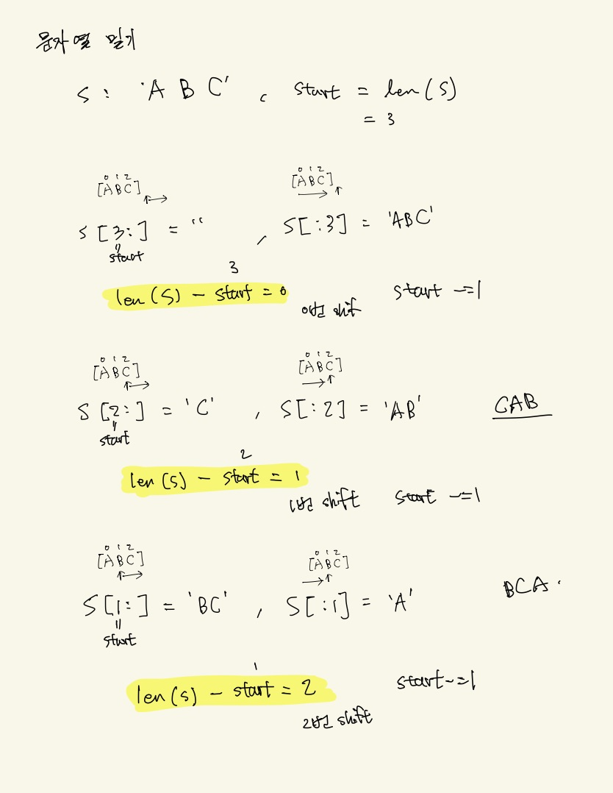

# Link
https://school.programmers.co.kr/learn/courses/30/lessons/120921

# 참고 : 슬라이싱 감잡기 (중요)
```python
s1 = "ABC"
index = len(s1)

print(f"start = {index}")
print(f"s1[{index}:] = {s1[index:]}, s1[:{index}] = {s1[:index]}")
index-=1

print(f"s1[{index}:] = {s1[index:]}, s1[:{index}] = {s1[:index]}")
index-=1

print(f"s1[{index}:] = {s1[index:]}, s1[:{index}] = {s1[:index]}")
index-=1
```
<br/>

출력결과
```bash
start = 3
s1[3:] = , s1[:3] = ABC
s1[2:] = C, s1[:2] = AB
s1[1:] = BC, s1[:1] = A
```
<br/>

# 문제 풀이 아이디어 (중요)
`len(s) - start` 의 의미
- start 의 초기값은 len(s) 부터 시작한다.
- 반복문의 매 순간마다 start 는 -1 씩 차감된다.
- len(s) - start 의 의미는 몇번 차감했는지의 의미가 된다.

<br/>



<br/>
# python (1)
```python
def solution(A, B):
    start = len(A)
    
    while start:
	    ## 뒤의 문자열이 앞으로 된 문자열 + 나머지 앞의 문자열 
        concat = A[start:] + A[:start]
        if concat == B:
            return len(A) - start
        start-=1
        
    return -1
```

# python (2)
```python
def solution(A, B):
    return (B*2).find(A)
```


