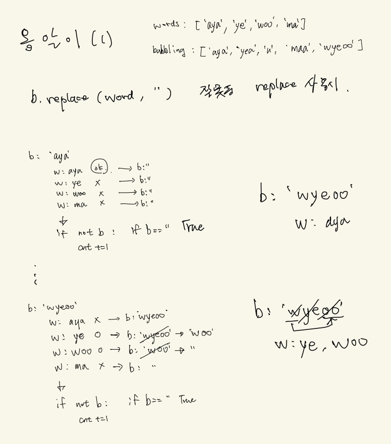
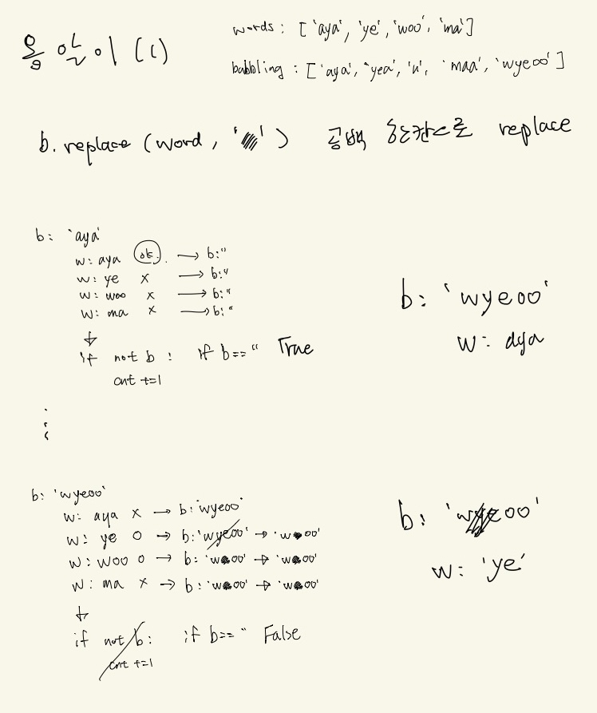

# 옹알이 (2)

# Link
https://school.programmers.co.kr/learn/courses/30/lessons/133499

# 문제 풀이 아이디어
## (1) 잘못된 replace 사용시 : 중복된 카운팅 발생


## (2) : (1) 의 문제를 수정



# python
```python
def solution(babbling):
    word = ["aya", "ye", "woo", "ma"]
    count = 0
    
    for b in babbling:
        for w in word:
            if w*2 in b:
                break
            b = b.replace(w, " ")
        
        if not b.strip():
            count+=1
    
    return count
```
<br/>


